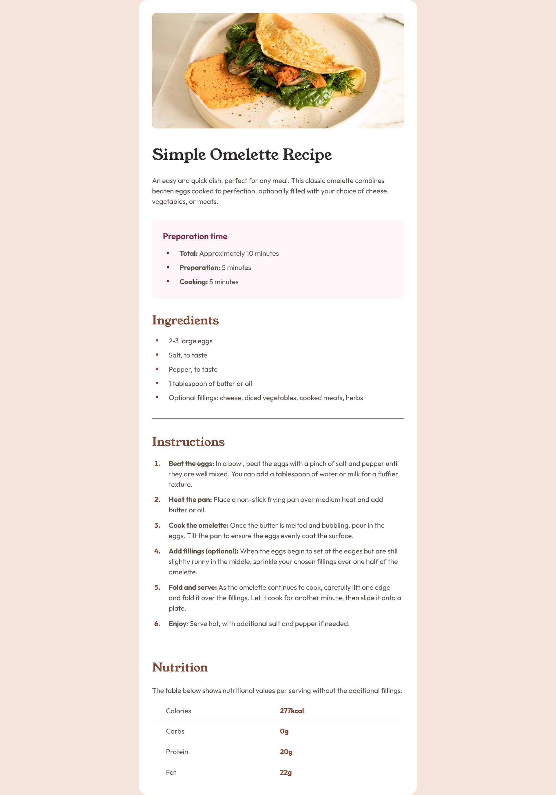

# Frontend Mentor - Recipe page solution

This is a solution to the [Recipe page challenge on Frontend Mentor](https://www.frontendmentor.io/challenges/recipe-page-KiTsR8QQKm). Frontend Mentor challenges help you improve your coding skills by building realistic projects. 

## Table of contents

- [Overview](#overview)
  - [The challenge](#the-challenge)
  - [Screenshot](#screenshot)
  - [Links](#links)
- [My process](#my-process)
  - [Built with](#built-with)
  - [Useful resources](#useful-resources)
- [Author](#author)

## Overview

### Screenshot

### Links

- Solution URL: [https://katherin467.github.io/fm-recipe-page/]

## My process

### Built with

- Semantic HTML5 markup
- CSS custom properties
- Flexbox
- Mobile-first workflow

### Useful resources

- [Vertically centering bullets](https://idkshite.com/posts/vertical-center-bullet) - This helped me with vertically centering the bullet points in the "Preparation Time" and "Ingredients" sections, which display this behavior when the list item spans multiple lines. 
- Stack Overflow posts [here](https://stackoverflow.com/questions/2535112/using-css-how-to-change-only-the-2nd-column-of-a-table) and [here](https://stackoverflow.com/questions/1257430/how-can-i-apply-a-border-only-inside-a-table) - These posts helped me with styling particular sections of my table in the "Nutrition" section. 

## Author

- Website - [Katherine Lim](https://katherin467.github.io/)
- Frontend Mentor - [@katherin467](https://www.frontendmentor.io/profile/katherin467)